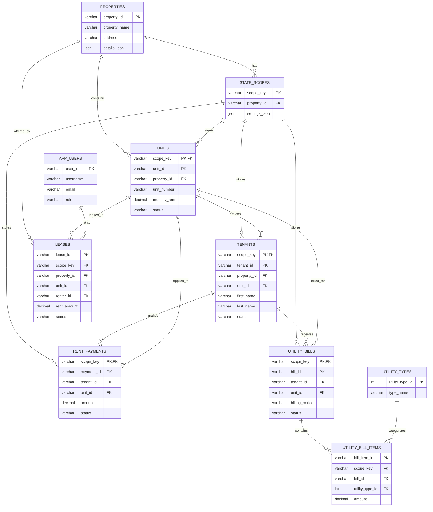

# Room to Live database relationships

`UTILITY_BILL_ITEMS` resolves the many-to-many relationship between utility bills and utility types: each bill can contain multiple charge types, and each charge type can appear on many bills.
